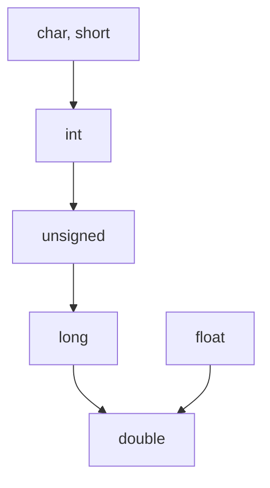

# 计算导论与C语言基础
## 感性认识计算机程序
简单程序
```c++
#include<iostream>
using namespace std;
int main()
{
    int a = 0;
    cout<<"请输入一个数"<<endl;
    cout<<"我刚刚输入的数a:"<<a<<endl;
    return 0;
}
```
顺序语句
```c++
#include<iostream>
using namespace std;
int main()
{
    int a = 0, b=0, result=0;
    cout<<"please input two numbers:";
    cin>>a>>b;
    result=3*a-2*b+1
    cout<<"result is: "<<result<<endl;
    return 0;
}
```
分支语句 (if语句)
```c++
#include<iostream>
using namespace std;
int main()
{
    int x=0, y=0;
    cin>>x>>y;
    if(x>y)
        cout<<"Max number is"<<x<<endl;
    else
        cout<<"Max number is: "<<y<<endl;
    return 0;
}
```
循环语句 (for语句)
```c++
#include<iostream>
using namespace std;
int main()
{
    int i=0;
    cout<<"20以内的技术:"<<endl;
    for(i=0;i<20;i++) // backward: (i=20;i>=0;i--)
    {
        if(i%2 !=0)
            cout<<i<<endl;
    }
}
```
常用的结构 - 数组
```c++
#include<iostream>
using namespace std;
int main()
{
    int i = -;
    char a[10] = {'a','b','c','d','e','f','g','h','i','j'};
    cout<<"字母表中序号为奇数的前五个字母:",endl;
    for (i=0; i<10; i=i+2)
    {
        cout<<a[i]<<endl;
    return 0;
}
```
综合(可读性：注释/缩进)
```C++
#include<iostream>
using namespace std;
int main()
{
    char a =''; //用于存放用户输入的字母
    cout<<"猜猜我是哪个字母，最多猜5次哦: "<<endl;
    int i = 0; //用于记录猜过多少次了
    for (i=0; i<5; i++)
    {
        cin>>a;
        if(a == 'G') //如果猜中
        {
            cout<<"被你猜中了！"<<endl;
            break //终止循环
        }
        else //如果没有猜中
            cout<<"你猜错了！接着猜吧！"<<endl;
    }
    return 0;
```

## 理性认识计算机程序
C程序设计语言
### C语言的由来
从机器语言到高级语言
**低级语言**
- 机器语言
- 汇编语言

**高级语言**
- FORTRAN
- Algol 60 (标志着计算科学的诞生)
- BCPL
- B语言 (UNIX)
- C语言 (重新开发UNIX)

### C语言的标准
- K&R C
- ANSI C 和 ISO C
- C99
- C11
- C17
- C23

相同程序在不同编译器上有不同解释 => 相同程序在不同平台上运行结果不同
例如：整型变量定义；对++, --的解释；输入输出赋值顺序的不同；浮点数计算精度的不同......

From C to C++

本门课：在C++环境中学习C语言部分

### C语言的构成
如何学习一门编程语言 => 如何学习语法知识

成份设计语言的构成：
- 数据成分: 有哪些数据类型？如何使用？
- 运算成分：有哪些运算符号？如何使用？
- 控制成分：三种类型（顺序，分支，循环）的控制语句如何写？
- 传输成分：在程序中如何输入和输出数据？
---- 计算机科学技术百科全书

## C语言数据成分
### 变量的定义
#### 储存空间单位
$2 ^ {10} $ = 1024
1B = 8b
1KB = 1024KB
1GB = 1024B
1TB = 1024GB
1PB = 1024TB

**变量：先定义 再使用**
- 值可以变化的量
- 变量的定义格式: (变量类型) (变量标识符);

#### C++ 的数据类型

**基本数据类型**
- 布尔型 (bool)
- 字符型 (char)
- 整型 (int)
- 实型 (浮点型)  
  - 单精度型 (float)  
  - 双精度型 (double)  

**自定义数据类型**
- 数组型 (类型[ ])  
- 指针型 (类型 *)  
- 构造数据类型  
  - 结构体型 (struct)  
  - 联合体型 (union)  
- 类 (class)  
- 枚举型 (enum)  
- 空类型 (void)

### 整数型的分类
- 基本型 int 32b (4B)
- 短整形 short 16b (2B)
- 长整型 long 32b (4B)

有符号/无符号 (signed/unsigned)

如何知道某种类型的数占多少字节？
sizeof运算符

```C++
#include <iostream>
using namespace std;
int main()
{
 cout<<"sizeof(short int)="<<sizeof(short int)<<endl;
  cout<<"sizeof(short int)="<<sizeof(int)<<endl;
  cout<<"sizeof(short int)="<<sizeof(long int)<<endl;
}
```
### 整数型的存储
负数补码的求法
signed int i = -123;
1. 先确定其符号位为1;
2. 求出其绝对值的原码;
3. 对原码各位取反
4. +1

### 整数的输入输出
```c++
#include <iostream>
using namespace std;
int main()
{
    int a = -123;
    cout<<hex<<a<<endl; // ffffff85
    cout<<oct<<a<<endl; // 37777777605
    cout<<dec<<a<<endl; // -123
    return 0;
}
```

---

```c++
#include <iostream>
using namespace std;
int main()
{
    int a = ox7FFFFF85;
    cout<<dec<<a<<endl; // 2147483525
    cout<<oct<<a<<endl; // 17777777605
    return 0;
}
```

---

```c++
#include <iostream>
using namespace std;
int main()
{
    int a = 037777777605;
    cout<<dec<<a<<endl; // 2147483525
    cout<<hex<<a<<endl; // ffffff85
    return 0;
}
```

### 最大与最小整数
**最大的整数**
```c++
#include <iostream>
using namespace std;
int main()
{
    unsigned int a = 0xFFFFFFFF
    cout<<dec<<a<<endl; // 4294967295
    return 0;
}
```

---

```c++
#include <iostream>
using namespace std;
int main()
{
    signed int a = 0x7FFFFFFF
    cout<<dec<<a<<endl; // 2147483647
    return 0;
}
```
**最小的整数**
```c++
#include <iostream>
using namespace std;
int main()
{
    signed int a = 0x7FFFFFFF
    a = a+1;
    cout<<dec<<a<<endl; // -2147483648
    return 0;
}
```
当最高位是1其他位为0 (-0) 时，最高位既表示负号，也表示整数最高位1。

**注意：初始化变量**

### 浮点型
#### 浮点型的分类
- float 32b (有效位7位)
- double 64b (有效位15位)
- long double 64b (有效位15位)

默认打印六位精度
操作控制符：setprecision()

#### 浮点型的存储
1位符号为
8位指数位（含1位符号位）
23位二进制小数位（默认为1.XXXX）

#### 浮点型使用须知
避免大数小数相加

```c++
#include <iostream>
using namespace std;
int main()
{
    float a = 0, b = 0;
    a = 123456.789e5;
    b = a + 20;
    cout<<setprecision(20)<<b<<endl; // 12345678848
    return 0;
}
```

### 字符型
- 一个字符占一个字节
  - 其值可以是任何“可以出现在C/C++”中的字符
  - 最多可以表示$2^8 = 256$个字符
- American Standard Code for Information Interchange 美国标准信息交换码
  
##### 字符型食用须知
由于存储类型和整型相同：
- 可以与整型数据相互赋值
- 可以和整数一样进行运算

```c++
#include <iostream>
#include <iomanip>
using namespace std;
int main()
{
    char a = 64;
    int b = 'Z';
    int c = b - a;
    char d = 6 + 256;
    cout<<a<<" "<<b<<" "<<c<<" "<<d<<endl; // @ 90 26 ♠
    return 0;
}
```

转义字符
```c++
#include <iostream>
using namespace std;
int main()
{
    cout<<"This is the first line ! \n";
    cout<<'\a'<<'\\'<<'\n';
    return 0;
}
```

### 布尔型
- 用于存储“真”和“假”的变量
  - 占一个字节
  - 其值只能为1或0
    - 1代表True
    - 0代表False
- 赋给布尔型变量的值
  - 赋0存0，表示False
  - 赋非零存1，表示True

```c++
#include <iostream>
using namespace std;
int main()
{
    bool b1 = true, b2 = false;
    cout<<"b1 = true 时，b1 = "<<b1<<endl; // 1
    cout<<"b2 = false 时，b2 = "<<b2<<endl; // 0
    b1 = 7>3;
    b2 = -100;
    cout<<"b1 = 7 > 3 时，b1 = "<<b1<<endl; // 1
    cout<<"b2 = -100 时，b2 = "<<b2<<endl; // 1
    return 0;
}
```

### 常量
常量：在程序运行过程中，其值保持不变的量
- 字面常量
- 符号常量

```c++
#include <iostream>
using namespace std;
int main()
{
    const double PI = 3.14159;
    float r, area;
    cin>>r;
    area = r * r * PI;
    cout<<"Area = "<<area;
    return 0;
}
```

常量类型
- 整型常量的后缀
  - n = 10000L; // 长整型变量
  - m = -0x88abL; // 长整型十六进制常量
  - k = 10000U; // 无符号整型常量
  - i = 07777LU; // 无符号长整型八进制常量
- 浮点型常量的后缀
  - x = 3.1415F; // 单精度浮点型常量
  - y = 1.1415L; // 长双精度浮点型常量
- 说明
  - 浮点型常量默认为double型
  - U, L, F均可以小写

## 变量命名

- 匈牙利命名法 如：chGrade; nLength; bOnOff; strStudentName;
- 驼峰命名法 如：myFirstName; myLastName; nextStudentName; intCount; printEmployeePaychecks();

原则：清晰易懂

## C语言运算成分
运算符
- 求字节数运算符：sizeof
- 下标运算符：[ ]
- 赋值运算符：=
- 算术运算符：\+ - * / %
- 关系运算符：< > == >= <= !=
- 逻辑运算符：! && ||
- 条件运算符：? :
- 逗号运算符：,
- 位运算符：\>> ~ | ^ &
- 指针运算符：\* &
- 强制类型转换运算符：(类型)

### 赋值运算
- 要点一：两边类型不同要进行类型转换（转换成左边的类型）
- 要点二：长数赋给短数 截取长数的低n位送给短数
- 要点三：短数赋给长数 不变
  - 无符号数 long型高16位补0
  - 有符号数
    - short型最高位为0 long型高16位补0
    - short型最高位为1 long型高16位补1
- 要点四：符号位的赋值处理 直接赋值

### 赋值运算的说明
**表达式**
程序中由运算符、操作数和括号组成等所组成的计算试，是计算求值的基本单位。

连续的赋值运算：自右而左的结合顺序


### 算术运算
注意：
整数运算，结果仍为整数
e.g. 5/3; // 1

实数运算，结果为double型
e.g. 5.3/3 //结果为double型
舍入的方向随编译器的不同而不同

剪刀法求表达式的值

计算过程中的类型转换


### 自增自减运算
- ++i, --i: 在使用i之前，先将i的值加（减）1
- i++, i--: 在使用i之后，再将i的值加（减）1

e.g. i的值为3，则
```
- j = ++1; // i = 4, j = 4
- j = 1++; // i = 4, j = 3
- cout<<++i; // 4
- cout<<i++; // 3
- cout<<-i++<<endl; // i = -3, 4
- cout<<-++i<<endl; // i = -4, 4
```

```c++
int main()
{
    int a = 0, b = 0, c = 2, d = 0, e = 2, f = 2;
    cout<<a<<" "<<a++<<" "<<endl; // 1 0
    cout<<++b<<" "<<b++<<" "<<endl; // 2 0
    cout<<c<<" "<<(c++)+(++c)<<" "<<endl; // 4 6
    cout<<(d=f++)+(e=f)<<endl; // 4
    cout<<f<<" "<<d<<" "<<e<<ednl; // 3 2 2
    return 0;
}
```

### 关系运算符
高优先级

- <
- <=
- \>
- \>=
  
低优先级

- ==
- !=

关系运算的表达式的值：真/假

### 逻辑运算与混合运算

- 逻辑与 &&
- 逻辑或 ||
- 逻辑非 !

运算优先级
! > && > ||

#### 运算符的优先级
逻辑非 (!) > 算术运算符 > 关系运算符 > "&&"和"||" > 赋值运算符

逻辑运算的取舍
只有在必须执行下一个逻辑运算符才能求出表达式的解时，才执行该运算符

#### 运算对象的扩展
逻辑运算符两侧可以是任何类型
如：字符型、实型或指针型等
系统最终以0 和 非0 来判定它们
e.g. 'C' && 'd'
'c'和'd'的ASCII值都不为0，按“真”处理

应用实例：
判断闰年
符合下面两者之一：
- 能被4整除，但不能被100整除
- 能被100整除，又能被400整除

求解：
可以用如下逻辑表达式来判断year是否为闰年：
(year % 4 == 0 && year % 100 != 0) || year % 400 == 0
或判别year是否非闰年：
(year % 4 != 0) || (year % 100 == 0 && year%400 != 0)

### 其他运算符（逗号，条件，强转）

**逗号运算符**
用逗号将表达式连起来
整个表达式的值为表达式n的值

**条件运算符**
形式：
表达式1?表达式2:表达式3

求值规则：
如果表达式1的值为真，则以表达式2的值作为条件表达式的值；否则以表达式3的值作为整个条件表达式的值

max = (a>b)?a:b;

相当于：
if (a>b) max = a;
else max = b

**强制类型转换**
形式：
(类型名)(表达式)

注意：
强制类型转换后，被转换的量并没有发生变化

## C语言控制成分

- 什么样的结构才能支持程序运行的逻辑？
- 任何具有单入口但出口的程序都可以用三种基本结构表达：
  - 顺序结构
  - 分支结构
  - 循环结构

### 分支结构

if语句
```c++
#include <iostream>
using namespace std;
int main()
{
    int year = 0;
    cin >> year;
    if (year % 4 == 0)
    {   
        if (year % 100 == 0)
        {   
            if (year % 400 == 0)
                cout << "Y";
            else
                cout << "N";
        }
        else
            cout<<"Y";
        
    }
    else
        cout << "N";
}
```

swich语句
```c++
switch(表达式)
{
    case 常量表达式1: 语句1;
    case 常量表达式2: 语句2;
    ...
    case 常量表达式n: 语句n;
    default: 语句n+1;
}
```

### 循环结构
- for
- while
- do...while
- goto, if

```c++
#include <iostream>
using namespace std;
int main()
{
    int i, sum = 0;
    i = 1;
    while (i <= 100)
    {
        sum = sum + i;
        i++;
    }
    cout<<sum<<endl;
    return 0;
}
```

例：小红10岁，父亲33岁，问多少年之后，父亲的年龄是小红的二倍？
```c++
#include <iostream>
using namespace std;
int main()
{
    int ageOfHong = 10m ageOfFather = 33, count = 0;
    while (2 * ageOfHong != ageOfFather)
    {
        ageOfHong++;
        ageOfFather++;
        count++;
    }

cout<<count;
return 0
}
```

do...while语句
do
{
    执行语句;
} while (条件语句)

**至少执行一次**

```c++
#include <iostream>
using namespace std;
int main()
{
    int i, sum = 0;
    i = 1;
    do
    {
        sum = sum + i;
        i ++
    } while (i <= 100);
    cout << sum << endl;
    return 0;
}
```

```c++
#include <iostream>
using namespace std;
int main()
{

}
```

转向控制语句: **break** 和 **continue**

```c++
#include <iostream>
using namespace std;
int main()
{
    int n = 0;
    for (;;) // while (True)
    {
        cin >> b;
        if (n == 0)
            break;
    }
    return 0;
}
```

```c++
#include <iostream>
using namespace std;
int main()
{
    int n, counter = 0;
    for (n = 1; n <= 100; n++)
    {
        if (n % 3 == 0 || n % 5 == 0 || n % 7 == 0)
            continue;
        cout << n << '\t';
        counter++;
        if (counter % 10 == 0)
            cout << endl;
    }
    cout << endl;
    return 0;
}
```

## C程序中的数组

### 一维数组

数组的定义
数组名[常量表达式]

```c++
#include <iostream>
using namespace std;
int main()
{
    const int i = 4;
    int a[i] = {1, 2, 3, 4};
    cout << "a[0]=" << a[0] << endl
        << "a[1]=" << a[1] << endl
        << "a[2]=" << a[2] << endl
        << "a[3]=" << a[3] << endl;
    return 0;
}
```

数组的初始化
```c++
int a[] = {1, 2, 3, 4};
```

```c++
int a[4] = {1, 2}; // 1, 2, 0, 0
```

```c++
int a[4] = {0}; // 0, 0, 0, 0
```

### 二维数组

```c++
int a[3][4]; // 定义三行四列的数组
```

二维数组的初始化

```c++
#include <iostream>
#include <iomanip>
using namespace std;
int main()
{
int a[3][4] = {{1, 2, 3, 4}, {5, 6, 7, 8}, {9, 10, 11, 12}};
for (int i = 0; i < 3; i++)
{
    for (int j = 0; j < 4; j++)
        cout << setw(3) << a[i][j]; // 输出控制符（设置字符宽度）
    cout << endl;
}
return 0;
}
```

```c++
int main()
{
    int a[3][4] = {0};
    for (int i = 0; i < 3; i++)
    for (int j = o; j < 4; j++)
        a[i][j] = 4 * i + j + 1;

    for (int i = 0; i < 3; i++)
    {
        for (int j = 0; j < 4; j++)
            cout << setw(3) << a[i][j]; // 输出控制符（设置字符宽度）
        cout << endl;
    }
return 0;
}
```

### 数组的作用
#### 用数组做统计
例1 输入20个0～9的整数，统计每个数在输入数列中出现的次数
```c++
#include <iostream>
using namespace std;
int main()
{
    int num, count[10] = {0};
    for (int i = 0; i < 20; i++)
    {
        cin>>num;
        for (int j = 0; j < 10; j++)
        {
            if (num == j) count[j]++;
        }
    }
    for (int i = 0; i < 10; i++)
    {
        if (count[i] != 0)
            cout << i << "输入了" << count[i] << "次" << endl;
    }
    return 0;
}
```
---
更简单的方法：
```c++
for (i = 0; i < 20; i++)
{
    cin >> num;
    count[num]++;
}
```

#### 二维数组做统计

例2 某学校有1000位老师，分布在20个不同的学院，每个学院最多有12个系。编写一个程序，输入每位老师的所在院 (1-20)系 (1-12)编号，打印出各个系老师的数量

```c++
#incldue<iostream>
#incldue<iomanip>
using namespace std;
int main()
{ 
    int teacher[21][13];
    int school, department;
    int i, j;
    char name [30];

    for (i = 0; i < 1000; i++)
    {
        cin >> name >> school >> department;
        teacher[school][department]++;
    }

    for (i = 1; i < 2; i++)
        for (j = 1; j < 13; j++)
            cout << setw(4) << teacher[i][j];
    cout<< endl;
    return 0;
}
```
#### 下标做数轴
例3 输出100以内的所有素数

```c++
#include<iostream>
using namespace std;
int main(){
    bool prime = true;
    for (int i = 0; i < 100; i++)
    {
        prime = true;
        for (int j = 2; j < i; j++)
        {
            if (i % j == 0)
                prime = false;
        }
        if (prime == true)
            cout << i << endl;
    }
    return 0;
}
```

---

筛法求素数

```c++
#include<iostream>
#include<cmath>
using namespace std;
int main()
{
    int sum = 0, a[100] = {0};
    for (int i = 2; i < sqrt(100.0); i++)
    {
        sum = i;
        if (a[sum] == 0)
        {
            while (sum < 100)
            {
                sum = sum + i;
                if (sum < 100) a[sum] = 1;
            }
        }
    }
    for (int i = 2; i < 100; i++)
    {
        if (a[i] == 0) cout << i << " ";
    }
    return 0;
}
```

## C程序中的字符串
### 字符数组与字符串
```c++
#include <iostream>
using namespace std;
int main()
{
    char a[10] = {'a', 'b', 'c', 'd', 'e'};
    for (int i = 0; i < 10; i++)
        cout << a[i]; // abcde\0\0\0\0\0
    return 0;
}
```

```c++
char c[] = "China"; //China\0 所有字符串以\0结尾
```

#### 字符串赋值
```c++
#include <iostream>
using namespace std;
int main()
{
    char str1[] = "C++language", str2[20];
    int i = 0;
    while (str1[i] != '\0')
    {
        str2[i] = str1[i];
        i++;
    }
    str2[i] = '\0';
    cout << "String1: "<< str1 << endl;
    cout << "String2: "<< str2 << endl;
    return 0;
}
```

#### 二维字符数组
```c++
char weekday[7][11] = {"Sunday", "Monday", "Tuesday", "Wednesday", "Thursday", "Friday", "Saturday"};
```

#### 输入缓冲区
用cin输入数据
```c++
#include <iostream>
using namespace std;
int main() {
    float grade;
    cout << "enter grade: ";
    while (cin >> grade)
    {
        if (grade >= 85)
            cout << grade << "GOOD!" <<endl;
        if (grade < 60)
            cout << graade << "fail!" <<endl;
        cout << "enter grade: ";
    }
    return 0;
}
```

#### 一个字符的输入
- cin输入
- cin.get()输入 - 不会跳过空格和回车
  - 可以用于读入一个字符
  - cin.get(), cin.get(char)
- getchar()输入 - 不跳过任何字符

#### 一串字符的输出
```c++
#include <iostream>
using namespace std;
int main() {
    char a[10] = "Computer" // Computer 在第一个\0停止 没有\0会出错
    cout<<a;
    return 0;
}
```
---
```c++
#include <iostream>
using namespace std;
int main()
{
    char weekday[7][11] = {"Sunday", "Monday", "Tuesday", "Wednesday", "Thursday", "Friday", "Saturday"};
    for (int i = 0; i < 7; i++)
        cout << weekday[i] << endl;
    return 0;
}
```

#### 一串字符的输入
##### cin输入
```c++
#include <iostream>
using namespace std;
int main()
{
    char str[10];
    cout << "enter a sentence: " << endl;
    whie (cin >> str)
        cout << str << endl;
    return 0;
}
```
##### cin.get()输入
有三个参数的get函数
cin.get(ch, 10, '\n');
读取10-1个字符，赋给指定的字符数组。
如果在读取10-1个字符之前，遇到制定的终止字符（'\n'），则提前结束读取；（如果第三个参数没有指定则默认为'\n'）
读取成功返回非0值（真），失败（遇文件结束符）则返回0值（假）

```c++
#include <iostream>
using namespace std;
int main()
{
    char ch[20];
    cout << "enter a sentence: " << endl;
    cin.get(ch, 10, 'o')
    cout << ch << endl;
    return 0;
}
```

##### cin.getline()输入
```c++
#include <iostream>
using namespace std;
int main()
{
    char ch[20];
    cout << "enter a sentence: " << endl;
    cin.getline(ch, 10, 'o')
    cout << ch << endl;
    return 0;
}
```

##### getline与get区别
- getline遇到终止标志字符时结束，缓冲区指针移到终止标志字符之后；
- get遇到终止字符是停止读取，指针不移动

```c++
#incldue <iostream>
using namespace std;
int main()
{
    char a[10][10];
    int n = 0;
    cin >> n;
    cin.get(); // 读取多余的换行符
    for (int i = 0; i < n; i++)
        cin.getline(a[i], 10);
    for (int i = 0; i < n; i++)
        cout << a[i] << endl;
    return 0;
}
```

### 字符串应用例题
例1 字符串加密
输入一个字符串，把每个字符编程它的后续字符，如果是'Z'或者'z'则变成'A'或者'a'，空格不变，然后将变换后的字符串输出。要求能够接受连续输入

```c++
#include <iostream>
using namespace std;
int main()
{
    char str[200];
    while (cin.getline(str, 200))
    {
        for (int i = 0; str[i] != '\0'; i++)
        {
            if (str[i] == 'Z')
            {
                str[i] = 'A'; continue;
            }
            if (str[i] == 'z')
            {
                str[i] = 'a'; continue;
            }
            if (str[i] == ' ')
                 continue;
            str[i]++;
        }
        cout << str << endl;
    }
    return 0;
}
```

例2 字符串连接
输入两个字符串，将其中较短的串接到较长的串后面
要求：不适用系统函数strcat，每个输入的串的长度不超过20

```c++
#include <iostream>
using namespace std;

int main() {
    int len1, len2; 
    char str1[40], str2[40];

    cin.getline(str1, 20);
    cin.getline(str2, 20);

    for (len1 = 0; str1[len1] != '\0'; len1++);
    for (len2 = 0; str2[len2] != '\0'; len2++);

    if (len1 >= len2) {
        for (len2 = 0; str2[len2] != '\0'; len2++)
            str1[len1++] = str2[len2];   
        str1[len1] = '\0';               
    } else {
        for (len1 = 0; str1[len1] != '\0'; len2++)
            str2[len2++] = str1[i];
        str2[len2] = '\0';
    }

    cout << str1 << endl;
    cout << str2 << endl;
    return 0;
}

```

例3 统计单词数
输入一个英文句子（不超过80个字母），统计其中有多少个单词，单词之间用空格分开
```c++
#include <iostream>
using namespace std;
int main() {
    char str[80];
    int num = 0, flag = 0;
    cin.getline(str, 80);
    for (int i = 0; str[i] != '\0'; i++)
    {
        if (str[i] == ' ')
            flag = 0;
        else if (flag == 0)
        {
            flag = 1; num++;
        }
    }
    cout << "字符串中有" << num << "个单词" << endl;
    return 0; 
}
```